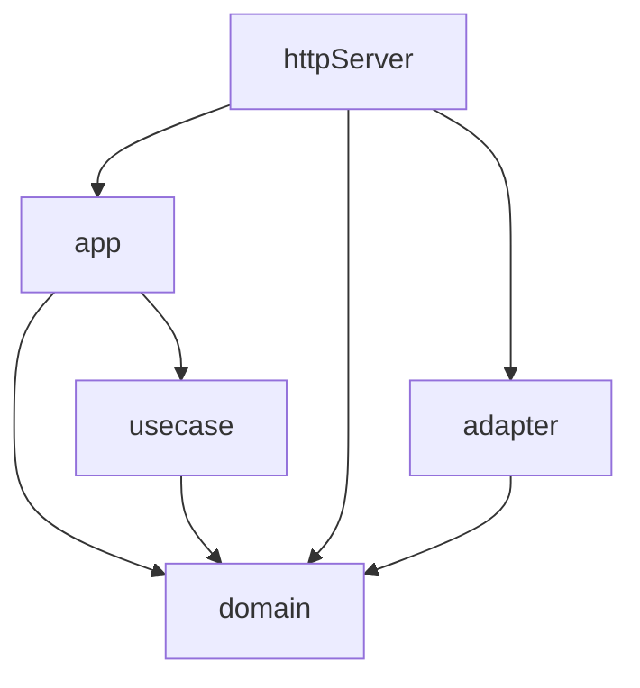

## sub project Dependencies



## Usage
migrate

```shell
export DB_DATABASE=example
export DB_URL="jdbc:mysql://0.0.0.0/${DB_DATABASE}?useSSL=false&allowPublicKeyRetrieval=true"
export DB_USER=root
export DB_PASSWORD=root

make db-migrate
```

run

```shell
export APP_ENV=DEV
sbt '~ httpServer/reStart'
```


## docker build
```shell
sbt 'httpServer/pack'
docker build -t id_http_server:latest .
docker run --rm -p 8080:8080 --network backend_default --env APP_ENV=LOCAL id_http_server
```

## Example

### http://localhost:8080/health-check
health check
```shell
curl -v -X GET http://localhost:8080/health-check
```

### http://localhost:8080/example

```shell
curl -v -X GET http://localhost:8080/example \
  -H "Content-Type: application/json" \
   -d '{"name":"exampple", "age": 10}'
```

```shell
# http clientを利用したendpoint
curl -v -X GET http://localhost:8080/example/http-run \
  -H "Content-Type: application/json"
```

```shell
# rdb (doobie)を利用したendpoint
curl -v -X GET http://localhost:8080/example/from-db \
  -H "Content-Type: application/json"
```

```shell
# backgroundで処理を実行するためのendpoint
curl -v -X GET http://localhost:8080/example/background-run
```

### http://localhost:8080/authed-route
認可が必要なエンドポイント
```shell
# get token
export CLIENT_ID=xxx
export CLIENT_SECRET=xxx
export AUDIENCE=xxx
export GRANT_TYPE=client_credentials

AUTH_TOKEN=$(curl --request POST \
  --url https://xxx/oauth/token \
  --header 'content-type: application/json' \
  --data "{\"client_id\":\"${CLIENT_ID}\",\"client_secret\":\"${CLIENT_SECRET}\",\"audience\":\"${AUDIENCE}\",\"grant_type\":\"${GRANT_TYPE}\"}" \
  | jq -r '.access_token')

curl -v -X GET http://localhost:8080/authed-route \
  -H Authorization": Bearer ${AUTH_TOKEN}"
```
